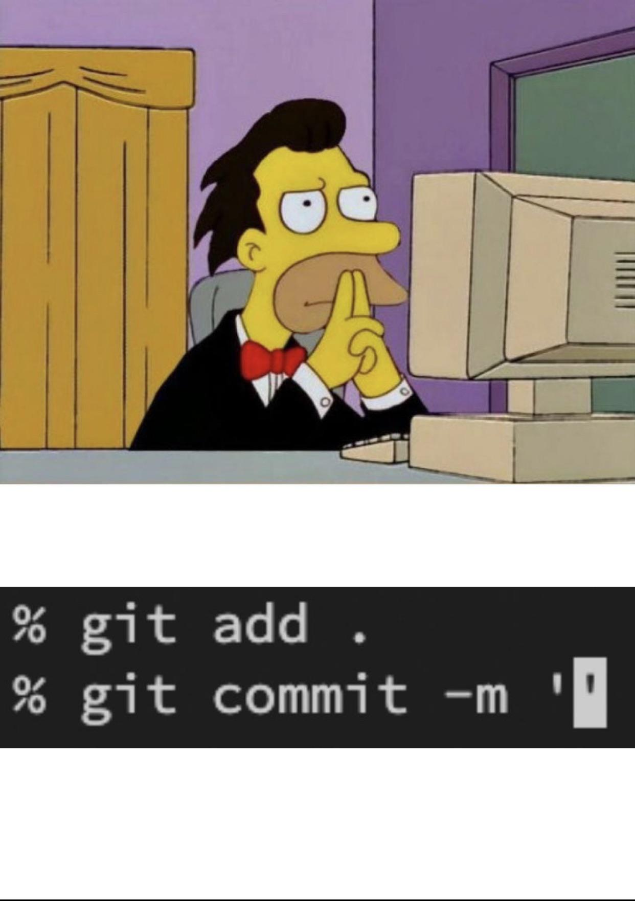

# Taller de Git, Pull Requests y Commits

## Herramientas fundamentales para el desarrollo colaborativo


---

# Cuando tu compañero de grupo te quiere enviar su código por WhatsApp

<style scoped>
img {
  display: block;
  margin: 0 auto;
}

h1 {
  text-align: center;
  font-size: 28px;
}
</style>


---

# Agenda

1. Fundamentos de Git
2. Workflow con Git
3. Buenas Prácticas para Commits
4. Pull Requests Efectivos
5. Casos Prácticos y Ejemplos

---

# 1. Fundamentos de Git

## ¿Qué es Git?

- Sistema de control de versiones distribuido
- Creado por Linus Torvalds en 2005
- Permite trabajar de forma colaborativa
- Mantiene la integridad de los cambios


---

# Conceptos clave de Git

- **Repositorio**: Almacén de archivos y su historial
- **Commit**: Fotografía del estado de los archivos
- **Branch (Rama)**: Línea independiente de desarrollo
- **Merge**: Unión de cambios entre ramas
- **Remote**: Copia del repositorio alojada en un servidor

---

# Configuración Inicial

```bash
# Configurar nombre de usuario
git config --global user.name "Tu Nombre"

# Configurar email
git config --global user.email "tu@email.com"

```

---

# 2. Workflow con Git

## Flujo de trabajo básico

```bash
# 1. Clonar repositorio
git clone https://github.com/usuario/repo.git

# 2. Crear rama para nueva funcionalidad
git checkout -b feature/nueva-funcionalidad

# 3. Realizar cambios y confirmarlos
git add .
git commit -m "Añadir nueva funcionalidad"

# 4. Subir cambios al repositorio remoto
git push origin feature/nueva-funcionalidad
```

---

# Git Flow


---

# 3. Buenas Prácticas para Commits

## Anatomía de un buen commit

1. **Mensajes claros y descriptivos**
2. **Tamaño adecuado** (un solo propósito)
3. **Convención de mensajes** (Conventional Commits)
4. **Asociación con issues/tareas**

---

# ¿Les ha ocurrido esto?

<style scoped>
img {
  display: block;
  margin: 0 auto;
}

h1 {
  text-align: center;
}
</style>



---

# Conventional Commits

```
<tipo>[ámbito opcional]: <descripción>

[cuerpo opcional]

[footer(s) opcional(es)]
```

Tipos comunes:

- **feat**: Nueva característica
- **fix**: Corrección de error
- **docs**: Documentación
- **style**: Formateo, punto y coma faltantes, etc.
- **refactor**: Refactorización de código
- **test**: Adición de pruebas
- **chore**: Tareas de mantenimiento

---

# Ejemplos de buenos commits

```bash
# Nueva funcionalidad
git commit -m "feat(auth): implementar inicio de sesión con Google"

# Corrección de error
git commit -m "fix(cart): solucionar cálculo incorrecto del total"

# Refactorización
git commit -m "refactor(api): optimizar consultas a la base de datos"

# Documentación
git commit -m "docs: actualizar README con instrucciones de instalación"
```

---

# ¿Qué NO hacer en los commits?

❌ Mensajes vagos: "Arreglado", "Actualización", "Cambios"

❌ Commits gigantes con múltiples cambios no relacionados

❌ Información sensible (contraseñas, tokens)

❌ Código comentado o archivos temporales

❌ Mezclar múltiples funcionalidades en un commit

---

# 4. Pull Requests Efectivos

## ¿Qué es un Pull Request?

- Mecanismo para proponer cambios a un repositorio
- Facilita la revisión de código (code review)
- Herramienta clave para colaboración
- Punto de control de calidad antes de integrar

---

# Anatomía de un buen PR

- **Título claro y descriptivo**
- **Descripción detallada**
  - Problema que resuelve
  - Cómo lo resuelve
  - Referencias a issues
- **Cambios pequeños y enfocados**
- **Tests incluidos** (cuando sea posible)
- **Documentación actualizada** (si aplica)

---

# Estrategias de Branching - Ship/Show/Ask

## Enfoque moderno propuesto por GitHub

- **🚢 Ship**: Cambios menores y de bajo riesgo que no requieren revisión formal
  - Correcciones de texto, mejoras de documentación simple
  - Se fusionan directamente a main/master sin PR formal
- **👁️ Show**: Cambios que requieren visibilidad pero no aprobación formal
  - Refactorizaciones menores, mejoras de rendimiento no críticas
  - Se crean PR para informar pero se auto-aprueban después de un tiempo
- **❓ Ask**: Cambios que requieren discusión y aprobación formal
  - Nuevas características, cambios arquitectónicos, correcciones críticas
  - PR completo con revisión detallada y aprobaciones requeridas

---

# Ejemplos de casos de uso: Ship/Show/Ask

## 🚢 Ship (Enviar directamente)

```bash
# Corregir un error tipográfico en README
git commit -m "docs: corregir typo en instrucciones de instalación"
git push origin main
```

- Actualizar documentación con información faltante
- Corregir enlaces rotos en páginas internas
- Pequeños ajustes de formato en archivos de configuración
- Actualizar versiones menores de dependencias con cambios compatibles

---

## 👁️ Show (Mostrar para informar)

```bash
# Refactorizar función auxiliar sin cambiar comportamiento
git commit -m "refactor: simplificar función formatDate()"
git push origin show/refactor-date-helpers
# Crear PR y auto-aprobar después de 24h si no hay comentarios
```

- Reorganizar archivos de código manteniendo la misma estructura lógica
- Optimizar consultas a base de datos no críticas
- Actualizar estilos visuales menores que no afectan la UX principal
- Agregar logs para mejor debugging

---

## ❓ Ask (Preguntar y esperar aprobación)

```bash
# Implementar nueva funcionalidad de autenticación
git commit -m "feat(auth): implementar inicio de sesión con Google"
git push origin feature/google-auth
# Crear PR detallado requiriendo al menos 2 aprobaciones
```

- Cambios en la lógica de negocio o algoritmos críticos
- Actualizaciones de seguridad importantes
- Migraciones de bases de datos
- Cambios en la arquitectura del sistema

---

# Plantilla de PR efectivo

```markdown
## Descripción

[Descripción clara y concisa de los cambios]

## Motivación y contexto

[¿Por qué es necesario este cambio? ¿Qué problema resuelve?]

## Tipo de cambio

- [ ] Nueva característica
- [ ] Corrección de error
- [ ] Mejora de rendimiento
- [ ] Refactorización de código
- [ ] Documentación

## Cómo se ha probado

[Describir las pruebas realizadas]

## Checklist

- [ ] El código sigue los estándares del proyecto
- [ ] Se han añadido pruebas
- [ ] La documentación ha sido actualizada
```

---

# Proceso de Code Review

- **Revisar el propósito**: ¿El PR soluciona el problema planteado?
- **Revisar la implementación**: ¿Es la mejor solución?
- **Revisar la calidad**: ¿El código es limpio y mantenible?
- **Revisar la funcionalidad**: ¿Funciona correctamente?
- **Revisar la seguridad**: ¿Hay vulnerabilidades?

---

# Buenas prácticas como autor del PR

- Proporcionar contexto suficiente
- Responder a los comentarios de forma constructiva
- Actualizar el PR según los comentarios recibidos
- Mantener el enfoque en el propósito original
- No tomar las críticas personalmente

---

# Buenas prácticas como revisor del PR

- Ser respetuoso y constructivo
- Enfocarse en el código, no en la persona
- Explicar el "por qué" de tus sugerencias
- Priorizar problemas importantes sobre detalles menores
- Aprobar cuando sea razonable, no buscar la perfección

---

# 5. Casos Prácticos y Ejemplos

## Caso 1: Workflow individual

1. Crear rama de feature desde `develop`
2. Desarrollar en commits pequeños y descriptivos
3. Rebase con `develop` si hay cambios
4. Crear PR detallado hacia `develop`
5. Aplicar feedback del code review
6. Mergear cuando esté aprobado

---

## Caso 2: Resolución de conflictos

```bash
# Actualizar la rama principal
git checkout main
git pull

# Volver a la rama de feature y hacer rebase
git checkout feature/mi-funcionalidad
git rebase main

# Resolver conflictos manualmente en los archivos
# Marcar como resuelto y continuar
git add [archivos-con-conflictos-resueltos]
git rebase --continue

# Si todo está bien, forzar push a la rama remota
git push --force-with-lease origin feature/mi-funcionalidad
```

---

## Caso 3: Corrección de commits antes del PR

```bash
# Modificar el último commit
git commit --amend -m "feat: mensaje corregido"

# Reescribir los últimos 3 commits de forma interactiva
git rebase -i HEAD~3

# Juntar (squash) commits relacionados
# En el editor que se abre:
# pick 1a2b3c4 primer commit
# squash 2d3e4f5 segundo commit
# squash 3g4h5i6 tercer commit

# Forzar push a la rama remota
git push --force-with-lease origin feature/nueva-funcionalidad
```

---

# Herramientas útiles

- **GitHub/GitLab/Bitbucket**: Plataformas de alojamiento
- **Husky**: Hooks de Git automatizados
- **Commitlint**: Validación de mensajes de commit
- **Conventional Changelog**: Generación automática de changelogs
- **GitKraken/SourceTree**: Interfaces gráficas para Git

---

# Recursos adicionales

- [Pro Git Book](https://git-scm.com/book/en/v2)
- [Conventional Commits](https://www.conventionalcommits.org/)
- [GitHub Flow](https://guides.github.com/introduction/flow/)
- [GitLab Flow](https://docs.gitlab.com/ee/topics/gitlab_flow.html)
- [Atlassian Git Tutorials](https://www.atlassian.com/git/tutorials)

---

# ¡Gracias!

## Preguntas y respuestas
